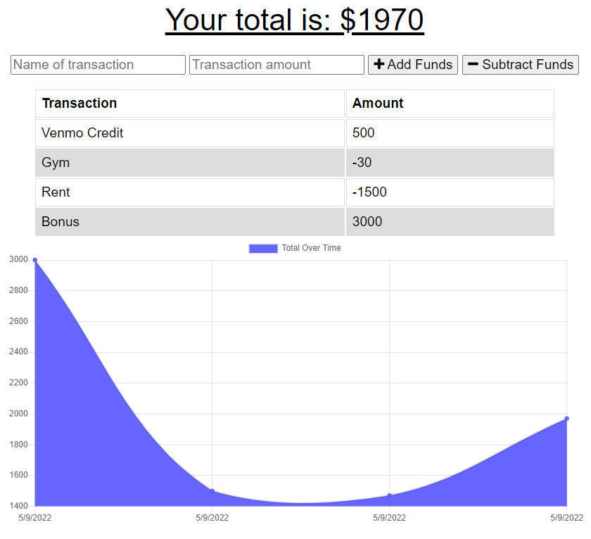

# PWA-Budget-Tracker

## The Motivation
This is a great challenge for me to grow my skills using progressive web apps. This challenge is a budget tracker that adds expenses and deposits to a budget with or without a connection to the internet.
## Challenges
Getting the items to load correctly was a task in itself. I was having the problem of items not saving correctly and getting fetched when back online. Also, received errors where local host wasn't firing offline and the app was not working. This challenge really shed light to the possibilties in assisting tech users with poor connection to still be able to utilize an app you create.

## Screenshot

## Live Heroku Deployment
https://agile-brook-49215.herokuapp.com/
